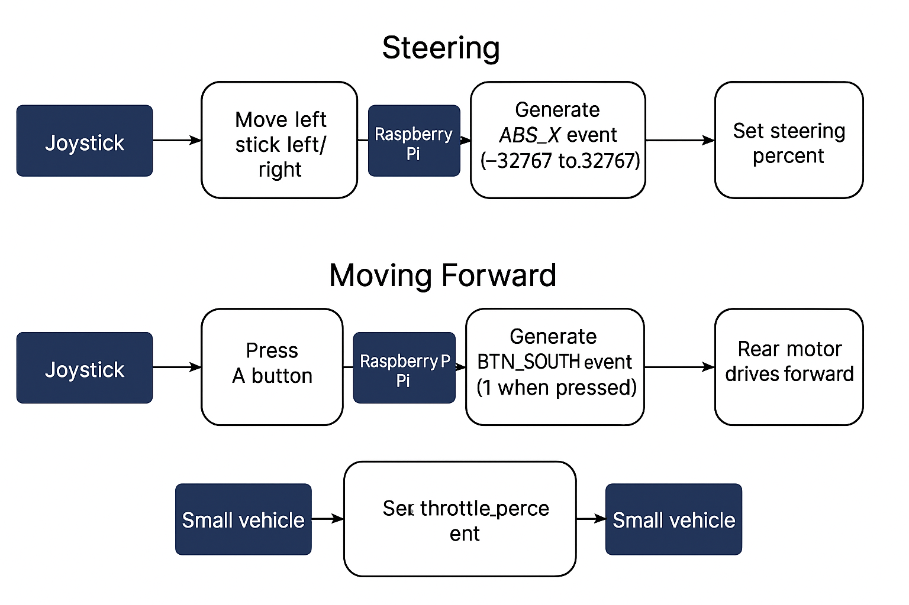

# How PiRacer Works with a Joystick (Xbox 360 Controller)



Below is a detailed, professional overview of the complete signal and control chain—from joystick movement to front-wheel actuation.

---

## End-to-End Input Pipeline

1. **Joystick ADC Sampling & HID Packetization**

   * The controller’s MCU samples the left stick X-axis via a 12-bit ADC (0–3.3 V → –32767…+32767).
   * Axis and button states are packaged into a 32–64 byte HID report with a CRC-16 checksum.

2. **2.4 GHz RF Transmission**

   * A Nordic nRF24L01-class RF transceiver broadcasts the HID report on an ISM-band channel.
   * ARQ and optional FEC mechanisms ensure packet integrity.

3. **USB Dongle Reception & Interrupt-IN**

   * The Pi’s USB dongle decodes RF, verifies the CRC, and emulates a USB Full-Speed (12 Mbps) HID gamepad.
   * It exposes an Interrupt-IN endpoint (8 bytes, ∼8 ms interval) to deliver reports to the host.

4. **Linux HID Core & evdev**

   * The `hid-generic` driver binds the device; `usbhid` schedules periodic transfers.
   * HID reports are parsed into `struct input_event` entries (type=EV\_ABS, code=ABS\_X, value=raw) under `/dev/input/eventN`.
   * **evdev** (event device) is the Linux kernel input subsystem interface that exposes these hardware events to user-space applications as standardized event files.

5. **User-Space Normalization (Python)**

   ```python
   from evdev import InputDevice, ecodes
   dev = InputDevice('/dev/input/eventN')
   for event in dev.read_loop():
       if event.type == ecodes.EV_ABS and event.code == ecodes.ABS_X:
           raw = event.value
           steering = -raw / 32767.0  # normalized to [–1.0, +1.0]
   ```

   * Inversion aligns positive values with rightward steering.

6. **PiRacer API Call**

   ```bash
   pip install piracer
   ```

   ```python
   import piracer
   piracer.set_steering_percent(steering)
   ```

   * The API selects the appropriate control channel on the PCA9685 PWM driver.

7. **I²C-Controlled PWM Configuration**

   ```bash
   pip install smbus2
   ```

   ```python
   from smbus2 import SMBus
   bus = SMBus(1)                 # /dev/i2c-1 (SDA=GPIO2, SCL=GPIO3)
   PCA9685_ADDR = 0x40
   # Configure MODE1 for 50 Hz output
   bus.write_byte_data(PCA9685_ADDR, 0x00, 0x10)
   # Write 12-bit ON/OFF counts to LEDn registers
   bus.write_i2c_block_data(PCA9685_ADDR, 0x06, [on_l, on_h, off_l, off_h])
   ```

8. **PWM Signal Generation (PCA9685)**

   * The PCA9685 outputs buffered PWM on 16 channels: a 50 Hz waveform with programmable duty cycle.
   * Pulse widths range from 1.0 ms (–1.0 steering) to 2.0 ms (+1.0 steering).

9. **Servo Actuation & Mechanical Steering**

   * The MG90S/MG996R servo interprets pulse width: 1.0 ms→–90°, 1.5 ms→0°, 2.0 ms→+90°.
   * The servo horn’s motion translates, via tie rods and Ackermann linkage, into precise front-wheel angle adjustments.

---

---

## 2. Press "A" Button (Moving Forward)

**Signal & Control Pipeline:**

```
Controller Digital Input → RF → USB HID → evdev → Python throttle mapping → PiRacer API → GPIO/I²C → Motor driver (H‑bridge) → Rear DC motors → Wheels
```

1. **evdev Digital Event**

   * `/dev/input/eventN` emits:

     ```c
     struct input_event ev = { .type = EV_KEY, .code = BTN_SOUTH, .value = state }; // state ∈ {0,1}
     ```

2. **Python Throttle Mapping**

   ```python
   from evdev import ecodes
   if event.type == ecodes.EV_KEY and event.code == ecodes.BTN_SOUTH:
       throttle = 0.5 if event.value == 1 else 0.0  # 50% forward on press, 0% on release
   ```

3. **PiRacer API Call**

   ```bash
   pip install piracer
   ```

   ```python
   import piracer
   piracer.set_throttle_percent(throttle)
   ```

   * Internally chooses PWM channels or digital lines for motor driver inputs.

4. **Motor Driver Interface**

   * The PiRacer expansion board integrates an H‑bridge driver (e.g., TB6612FNG).
   * Direction pins (DIR) are set via GPIO outputs; PWM pin is modulated for speed control.

5. **PWM or GPIO Output**

   * For I²C‑based drivers, `smbus2` sets PWM frequency (>200 Hz) on PCA9685.
   * For direct GPIO, `RPi.GPIO` or `pigpio` generates hardware PWM on designated pins (e.g., GPIO18).

   ```python
   import RPi.GPIO as GPIO
   GPIO.setup(18, GPIO.OUT)
   pwm = GPIO.PWM(18, 1000)  # 1 kHz for DC motor
   pwm.start(throttle * 100)  # duty% = throttle*100
   ```

6. **DC Motor Actuation**

   * The H‑bridge drives current through the rear gear motors (37-520), converting PWM duty cycle to rotational speed.
   * Brake/coast behavior managed by setting both driver inputs low or floating respectively.

7. **Mechanical Drive**

   * Motor output shafts transmit torque via gears and drive belt to the rear wheels, propelling the vehicle forward or halting it.

---

### I²C Bus Details

* **Protocol**: Master/slave, 7-bit addressing, ACK/NACK handshaking.
* **Speeds**: Standard (100 kHz), Fast (400 kHz), Fast Plus (1 MHz).
* **Transaction**: START → Slave Address + R/W → ACK → Register Addr → Data Bytes → STOP.

### PWM Fundamentals

* **Definition**: Varying duty cycle at fixed frequency to modulate power delivery.
* **Servo Frequency**: 50 Hz (20 ms period).
* **Duty Cycle Calculation**: Duty% = (PulseWidth(ms) / Period(ms)) × 100.
* **Steering Mapping**: 5% (1.0 ms) → full left, 7.5% (1.5 ms) → center, 10% (2.0 ms) → full right.

**Total Latency**: RF (\~1 ms) + USB poll (\~8 ms) + kernel parse (<1 ms) + Python (<1 ms) + I²C/PWM (<1 ms) = **<12 ms**

This pipeline ensures high-fidelity, low-latency steering control for the PiRacer platform.
